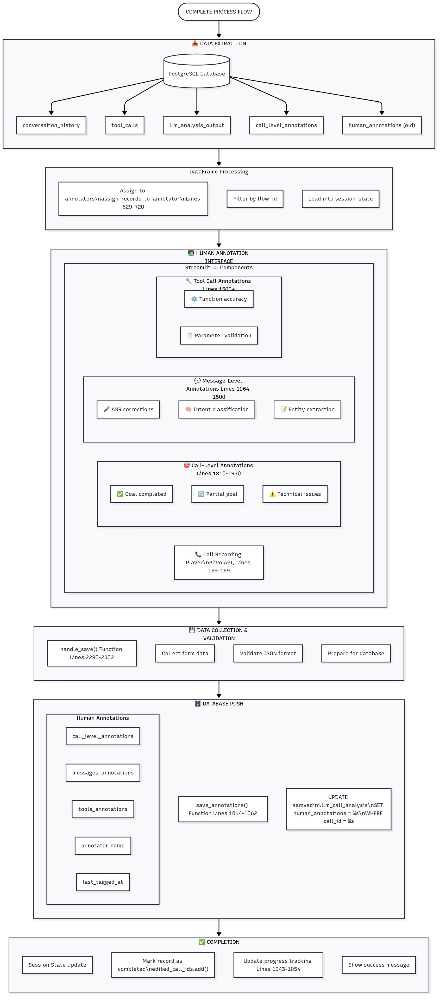

# LLM Annotation Tool

A Streamlit-based tool for annotating LLM-generated text with various quality metrics.

## Project Structure
# LLM Annotation Tool

A Streamlit-based tool for annotating LLM-generated text with various quality metrics.

## Project Structure

- `app.py`: Main application file
- `config.py`: Configuration settings and constants
- `data_handler.py`: Data loading and saving operations
- `ui_components.py`: Streamlit UI components
- `requirements.txt`: Project dependencies

## Setup

1. Install dependencies:
```bash
pip install -r requirements.txt
```

2. Prepare your input data:
   - Create a CSV file named `eval_tag_input.csv`
   - The CSV should contain at least a 'text' column with the content to annotate

3. Run the application:
```bash
Each tag can be marked as Pass (1) or Fail (0). 
- `eval_tagging_interface.py`: Main application file
- `config.ini`: Configuration settings and constants

## Setup

### Step 1: Clone the Repository
```bash
git clone <your-repository-url>
cd eval_tagging_interface
```
### Step 2: Install dependencies:
```bash
pip install -r requirements.txt
```
### Step 3: Configure Credentials
All secrets are managed in `config.ini`. Open the file and fill in your credentials for each service.

**Example `config.ini`:**
```ini
[rds-datawarehouse]
hostname=de-warehouse.ciqpn8ajz11z.ap-south-1.rds.amazonaws.com
username=samvadini_user
password=your_db_password
database=dev
port=24316

[api_keys]
plivo_auth_id = MAMDHH...your_plivo_id
plivo_auth_token = ZDFiZ...your_plivo_token
```
### Step 4: Run the application:
```bash
streamlit run app.py
```
## Workflow
Here is a Workflow diagram:




## Features

- Annotation interface for multiple quality metrics
- Progress tracking
- Automatic saving of annotations
- Clean and intuitive UI

## Tags

The tool supports the following annotation tags:
- Grammar & Spelling
- Repetition
- Extra Information
- Less Information
- Pure Hindi
- Relevance Choice
- Context Preservation

Each tag can be marked as Pass (1) or Fail (0). 
